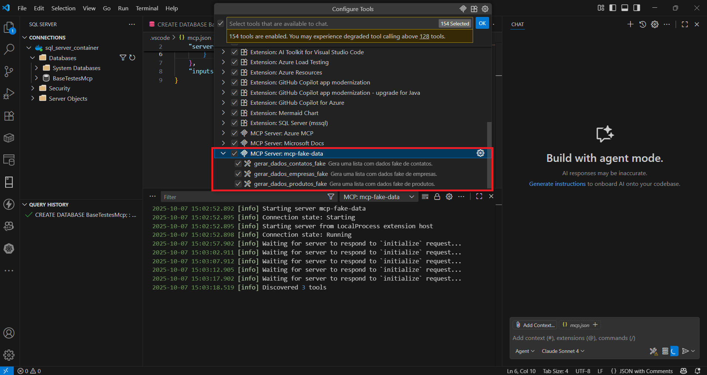
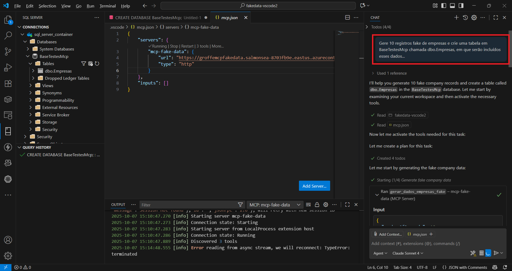
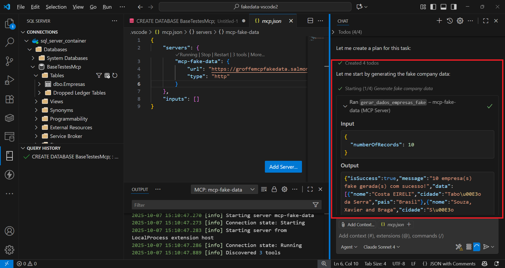
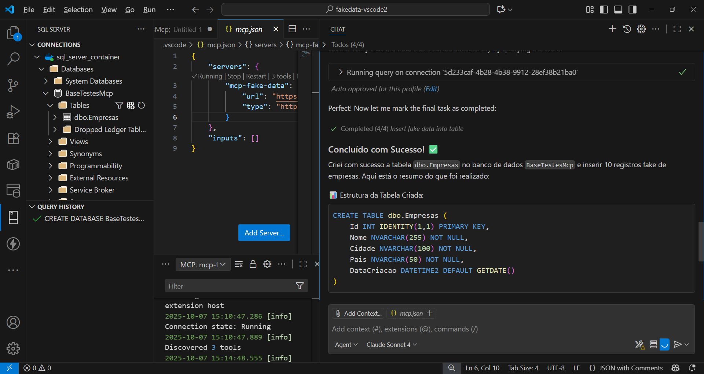
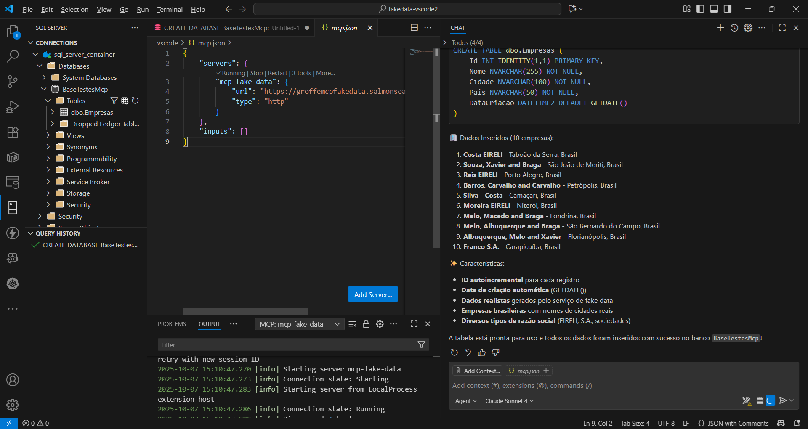
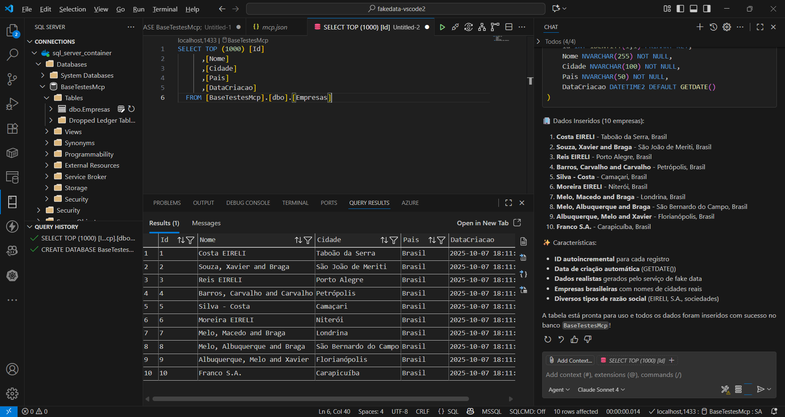

# aspnetcore9-mcp-fakedata
Implementação em ASP.NET Core + .NET 9 de MCP Server para a geração de dados fake de empresas, contatos e produtos no padrão brasileiro. Inclui o uso da biblioteca Bogus e de um Dockerfile para build de imagens da aplicação.

Este MCP Server também foi disponibilizado através da imagem **xrenatogroffe/aspnetcore9-mcp-fakedata**, que está como pública no Docker Hub:

https://hub.docker.com/repository/docker/renatogroffe/aspnetcore9-mcp-fakedata/general

```bash
docker pull renatogroffe/aspnetcore9-mcp-fakedata:1
```

Ao registrar este **MCP Server** no **Visual Studio Code** como um endpoint **http** (arquivo **/.vscode/mcp.json**):

```json
{
	"servers": {
		"mcp-fake-data": {
			"url": "endpoint_http",
			"type": "http"
		}
	},
	"inputs": []
}
```

Constarão 3 tools entre as opções de MCP disponíveis:



Ao realizar uma pergunta no **chat do GitHub Copilot** em modo **Agent**:



Tool do MCP sendo invocada:



Resultados ao invocar as MCP Tools (geração de dados de dados fake + criação/inclusão de dados em tabela):





